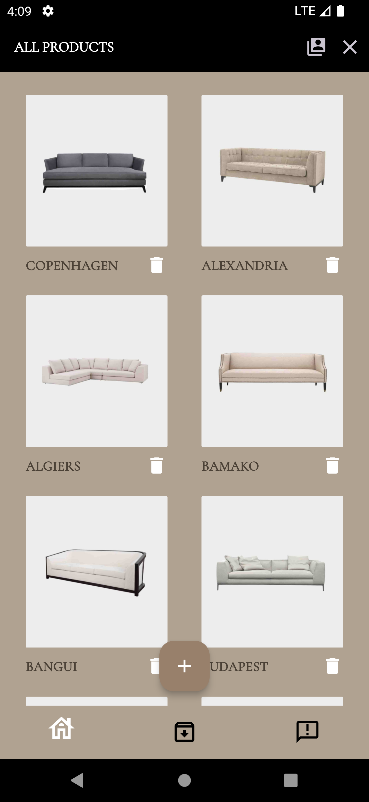

## TECHINICAL SKILLS
- Flutter/Dart
- Node.js / express
- Javascript
- Debugging
- Firebase
- Appwrite

  
## WORK EXPERIENCE
**Gemona West Lifestyle:**  2022 - present
 - Created an Augmented Reality / Ecommerce furniture app for clients in the real estate development and interior design industry.
 - Act as a point of contact between clients, vendors, and internal staff.
 - Handle incoming and outgoing communications.
 - Coordinate appointments, meetings.
 - Assist in the recruitment process
 - Provide IT support for staff, including troubleshooting.
 - Maintain organized and accurate records, including client contracts, project documents, and financial records
 - Manage office supplies, equipment, and maintenance to ensure a productive work environment.
 - Managing office technology and software systems. This includes troubleshooting technical issues and ensuring that the team has access to the necessary tools.

## PROJECTS

**1. LIFESTYLE (FLUTTER AUGMENTED REALITY FURNITURE APP)**

This is a Flutter-based Augmented Reality (AR) Furniture E-Commerce App for furniture shopping. This mobile application seamlessly combines the worlds of furniture shopping and augmented reality to provide users with an immersive and interactive shopping experience.

**Key Features:**

- Node.js Backend with MongoDB
- Firebase Push Notification: **
- Augmented Reality Furniture View
- Interactive 3D Model View of Furniture
- E-Commerce Functionality
- Product Search
- Order Tracking
- Admin Side Management 
- Paystack Payment Integration
- Company Documents View

**Technology Used:**

- **Frontend:**
  - Flutter

- **Backend:**
  - Node.js

- **Database:**
  - MongoDB

- **Push Notifications:**
  - Firebase Cloud Messaging (FCM)

- **Payment Integration:**
  - Paystack

**3D Model Preview**

**Some Screenshots**

 

Some improvements have been made to the UI, such as fixing inconsistent text colors and addressing other minor faults. I'll update the screenshots as soon as I'm chanced.

## 2. FLUTTER SMART-HOME ANIMATED UI

Welcome to the 'Animated Smart Home App'.

This is more like a flutter UI freestyle. It features some really cool animation with a futuristic look and feel.

**Animation Preview**

**3. FLUTTER ANALOG-CLOCK (LIGHT AND DART THEME)**
Welcome to the Flutter Analog-Clock.

This project is an actual working analog clock and not just a UI. It features both dark mode and light mode, automatically transitioning to dark mode at night and light mode during the day. However, if you wish to time travel to either daytime or nighttime, you can achieve that simply by tapping a button.

**Preview**

**Screenshots**

