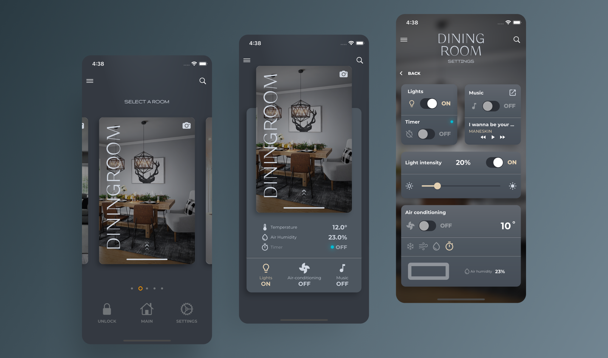

# TECHINICAL SKILLS

# WORK EXPERIENCE

# PROJECTS

## 1. LIFESTYLE (Flutter Augmented Reality Furniture App)

This is a Flutter-based Augmented Reality (AR) Furniture E-Commerce App for furniture shopping. This mobile application seamlessly combines the worlds of furniture shopping and augmented reality to provide users with an immersive and interactive shopping experience.

## Key Features:

- Node.js Backend with MongoDB
- Firebase Push Notification: **
- Augmented Reality Furniture View
- Interactive 3D Model View of Furniture
- E-Commerce Functionality
- Product Search
- Order Tracking
- Admin Side Management 
- Paystack Payment Integration
- Company Documents View

## Technologies Used:

- **Frontend:**
  - Flutter

- **Backend:**
  - Node.js

- **Database:**
  - MongoDB

- **Push Notifications:**
  - Firebase Cloud Messaging (FCM)

- **Payment Integration:**
  - Paystack

### 3D Model Preview

### Some Screenshots

 

Quick one, guys: Some improvements have been made to the UI, such as fixing inconsistent text colors and addressing other minor faults. I'm currently quite busy, but I'll update the screenshots as soon as possible.

## 2. FLUTTER SMART-HOME ANIMATED UI

Welcome to the 'Animated Smart Home App'.

This is more like a flutter UI freestyle. It features some really cool animation with a futuristic look and feel.

### Animation Preview

